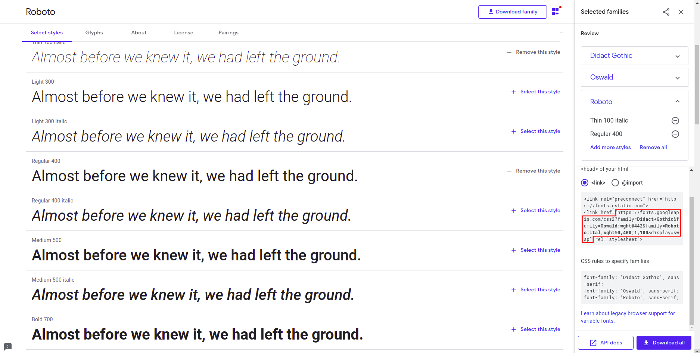

# Gatsby Plugin Fast Google Fonts

A minimal gatsby plugin to load google fonts efficiently in your Gatsby project.  
Based on the great post and experiments of [css wizardy](https://csswizardry.com/2020/05/the-fastest-google-fonts/)  

## Usage

Go to Google Fonts, selects all the fonts you want to include (remember to keep a limited number of fonts and variants to not slow down your website) and get the link.



Install the plugin on your Gatsby project by `yarn` or `npm`.  
`npm i gatsby-plugin-fast-google-fonts`  

Add the plugin to your `gatsby-config.js` file.

```js
plugins: [
    {
        resolve: `gatsby-plugin-fast-google-fonts`,
        options: {
          link: <the-link-you-got-from-google-fonts>
        },
    },
    // ... other plugins ...
],
```

This plugin is tested for version 2 of the google fonts API and requires `&display=swap` in the url.